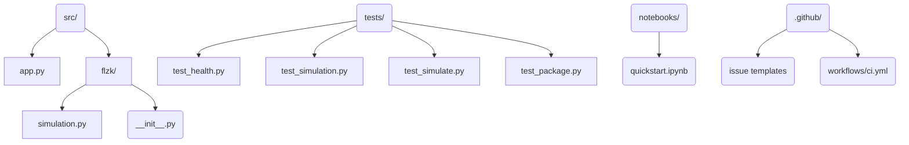

# cognitive-load-detector — FLZK-Inspired Federated Learning Demo


**cognitive-load-detector** is the public home of our FLZK simulator: a
verifiable, browser-friendly federated learning prototype with deterministic
metrics, an API surface, and collaboration-ready tooling. The repository name
honours the project’s heritage in cognitive-load research, while the current
code focuses on the FLZK protocol described in the accompanying paper.

## Why this matters
Federated learning prototypes often arrive as academic dumps that are hard to
reproduce. This repository demonstrates how a senior engineering team would
package the FLZK ideas—fast iteration tooling, CI, docs, notebooks—so recruiters
and contributors can evaluate production-minded craft rather than loose scripts.

## Feature highlights
- **Deterministic simulator** — `flzk.simulation.run_simulation` produces
  realistic accuracy/loss trajectories for demos and notebooks.
- **FastAPI service** — `/health` and `/simulate` mirror the interface of a
  future orchestration layer.
- **Streamlit dashboard** — Parameter exploration without touching code.
- **Reproducible tooling** — Pinned dependencies, `pyproject.toml`, release automation, CI, issue
  templates, and notebooks make onboarding painless.

## Repository layout


## Installation
```bash
git clone https://github.com/priyatham28/cognitive-load-detector
cd cognitive-load-detector
python -m venv .venv
source .venv/bin/activate
pip install -U pip
pip install -e .[dev]
```
Or run `make setup` to bootstrap everything in one step.

## Usage
### FastAPI service
```bash
make run
# In a second terminal
curl -s http://127.0.0.1:8000/health
curl -s -X POST http://127.0.0.1:8000/simulate \
  -H "content-type: application/json" \
  -d '{"rounds": 3, "learning_rate": 0.15}' | jq
```
Example output:
```json
{
  "rounds": 3,
  "num_peers": 4,
  "metrics": [
    {"round": 1, "acc": 0.784, "loss": 0.598},
    {"round": 2, "acc": 0.792, "loss": 0.586},
    {"round": 3, "acc": 0.8, "loss": 0.574}
  ],
  "privacy": {"eps": 1.3585, "delta": 1e-05},
  "backend": "mock"
}
```

### Streamlit dashboard
```bash
make demo
```
The app calls the FastAPI endpoints and renders the metrics so stakeholders can
experiment without writing code.

### Docker
```bash
docker build -t flzk-demo .
docker run -p 8000:8000 flzk-demo
curl -s http://127.0.0.1:8000/health
```

### Notebook
See `notebooks/quickstart.ipynb` for an interactive walkthrough of the
simulator and helper utilities.

## Project structure
```
.
├── CHANGES.md
├── CODE_OF_CONDUCT.md
├── CONTRIBUTING.md
├── LICENSE
├── Makefile
├── README.md
├── demo/
│   └── streamlit_app.py
├── notebooks/
│   └── quickstart.ipynb
├── src/
│   ├── app.py
│   └── flzk/
│       ├── __init__.py
│       └── simulation.py
└── tests/
    ├── test_health.py
    ├── test_package.py
    ├── test_simulate.py
    └── test_simulation.py
```

## Development workflow
```bash
make lint     # ruff
make type     # mypy
make test     # pytest + coverage
make build    # python -m build
make security # bandit + pip-audit
```
Run `pre-commit install` after `make setup` to mirror CI linting locally.

## Contribution guidelines
We welcome contributions that push the simulator closer to the real FLZK stack.
See [CONTRIBUTING.md](CONTRIBUTING.md) for branching strategy, testing
checklist, and review expectations. Governance is covered in the
[Code of Conduct](CODE_OF_CONDUCT.md).

## Documentation
- [Architecture](docs/architecture.md)
- [ADR 0001](docs/adr/0001-initial-architecture.md)
- [Roadmap](docs/roadmap.md)
- [Security Policy](SECURITY.md)

## Release management
- CI is green-gated via linting, typing, tests, security scans, and smoke tests.
- Tags matching `v*` trigger `.github/workflows/release.yml`, building wheels/sdists and attaching them to a GitHub Release automatically.
- Use `make release-notes` to draft the changelog before tagging.

## Security
Run `make security` locally to execute Bandit and pip-audit. Disclose vulnerabilities via [SECURITY.md](SECURITY.md).

## References
- Ramesh et al. *FLZK: Verifiable Browser-Based Peer-to-Peer Federated Learning
  with Zero-Knowledge DP-SGD*.
- Abadi et al. *Deep Learning with Differential Privacy*. Proceedings of the
  2016 ACM SIGSAC Conference.

## License
Released under the [MIT License](LICENSE).
