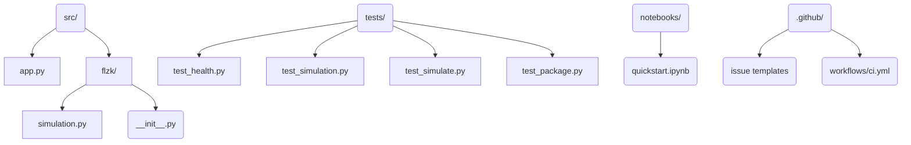

# FLZK — Verifiable Browser-Based Federated Learning


A pragmatic, recruiter-ready implementation of the FLZK concept: verifiable
browser-based federated learning with differential privacy safeguards. The goal
is to showcase how a senior engineering team would structure a demo-quality
service—complete with packaging, tests, documentation, and collaboration
tooling—rather than ship a throwaway prototype.

## Why this matters
Federated learning solutions are often presented as research artefacts that are
hard to reproduce. This repository demonstrates how to translate the ideas from
*FLZK: Verifiable Browser-Based Peer-to-Peer Federated Learning with
Zero-Knowledge DP-SGD* into a maintainable Python project. Hiring managers can
see production-minded code, and contributors get a clean slate for experimentation.

## Feature highlights
- **Deterministic simulator** — Synthesises round-by-round metrics via
  `flzk.simulation.run_simulation`, keeping demos repeatable.
- **FastAPI service** — `/health` and `/simulate` endpoints mirror the interface
  of a production orchestration layer.
- **Streamlit dashboard** — Non-technical stakeholders can tweak parameters
  without touching code.
- **Reproducible tooling** — `pyproject.toml`, pinned dependencies, CI, issue
  templates, and notebooks make the codebase welcoming to new engineers.

## Repository layout


## Installation
```bash
git clone https://github.com/priyatham28/cognitive-load-detector
cd cognitive-load-detector
python -m venv .venv
source .venv/bin/activate
pip install -U pip
pip install -e .[dev]
```
Alternatively run `make setup` to create the virtual environment and install all
tooling in one step.

## Usage
### FastAPI service
```bash
make run
# In a second terminal
curl -s http://127.0.0.1:8000/health
curl -s -X POST http://127.0.0.1:8000/simulate \
  -H "content-type: application/json" \
  -d '{"rounds": 3, "learning_rate": 0.15}' | jq
```
Example output:
```json
{
  "rounds": 3,
  "num_peers": 4,
  "metrics": [
    {"round": 1, "acc": 0.784, "loss": 0.598},
    {"round": 2, "acc": 0.792, "loss": 0.586},
    {"round": 3, "acc": 0.8, "loss": 0.574}
  ],
  "privacy": {"eps": 1.3585, "delta": 1e-05},
  "backend": "mock"
}
```

### Streamlit dashboard
```bash
make demo
```
The app reads the same FastAPI endpoints and renders the metrics as tables for
quick iteration during stakeholder reviews.

### Docker
```bash
docker build -t flzk-demo .
docker run -p 8000:8000 flzk-demo
curl -s http://127.0.0.1:8000/health
```

### Notebook
Browse `notebooks/quickstart.ipynb` for a hands-on walkthrough that imports the
simulation module, runs a demo, and plots the results inline.

## Project structure
```
.
├── CHANGES.md
├── CONTRIBUTING.md
├── CODE_OF_CONDUCT.md
├── LICENSE
├── Makefile
├── README.md
├── demo/
│   └── streamlit_app.py
├── notebooks/
│   └── quickstart.ipynb
├── src/
│   ├── app.py
│   └── flzk/
│       ├── __init__.py
│       └── simulation.py
└── tests/
    ├── test_health.py
    ├── test_package.py
    ├── test_simulate.py
    └── test_simulation.py
```

## Development
```bash
make lint     # ruff
make type     # mypy
make test     # pytest + coverage
make build    # python -m build
```

## Contribution guidelines
We welcome contributions that push the simulator closer to the real FLZK stack.
See [CONTRIBUTING.md](CONTRIBUTING.md) for branching strategy, testing
checklist, and review expectations. Serious incidents fall under the
[Code of Conduct](CODE_OF_CONDUCT.md).

## References
- Ramesh et al. *FLZK: Verifiable Browser-Based Peer-to-Peer Federated Learning
  with Zero-Knowledge DP-SGD*.
- Abadi et al. *Deep Learning with Differential Privacy*. Proceedings of the
  2016 ACM SIGSAC Conference.

## License
Released under the [MIT License](LICENSE).
