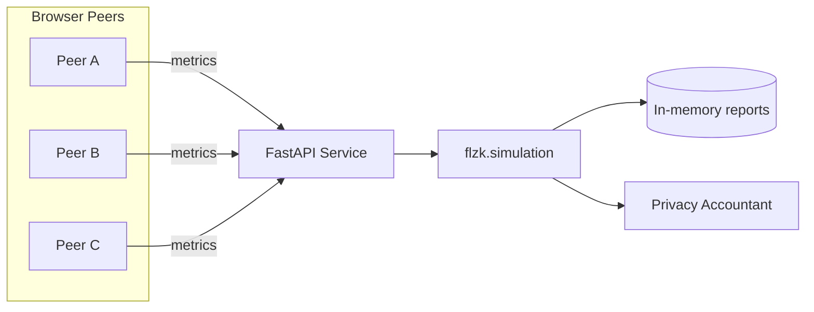

# System Architecture

## Components
- **FastAPI service** (`src/app.py`): validates requests, invokes the simulator,
  and publishes JSON responses compatible with the Streamlit dashboard.
- **Simulation core** (`src/flzk/simulation.py`): deterministic federated
  learning loop producing round metrics and privacy summaries.
- **Dashboard** (`demo/streamlit_app.py`): lightweight UI for non-engineers.
- **Notebooks** (`notebooks/quickstart.ipynb`): reproducible investigation of
  metrics and helper utilities.

## Data flow
1. Client submits a `/simulate` payload with hyperparameters and backend
   selection.
2. FastAPI converts the payload into a `SimulationConfig` dataclass.
3. Simulator iterates `rounds` times, adjusting accuracy/loss trends and
   computing a toy privacy budget.
4. Response is returned to the caller; dashboards/notebooks serialise and
   visualise the data.

## Operations considerations
- Stateless API so it can scale horizontally.
- Deterministic outputs -> easy to snapshot in notebooks/tests.
- Security scanning (`bandit`, `pip-audit`) baked into `make security` and CI.
- Release packaging done via `python -m build`; release workflow attaches
  artifacts to GitHub releases.
